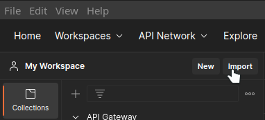
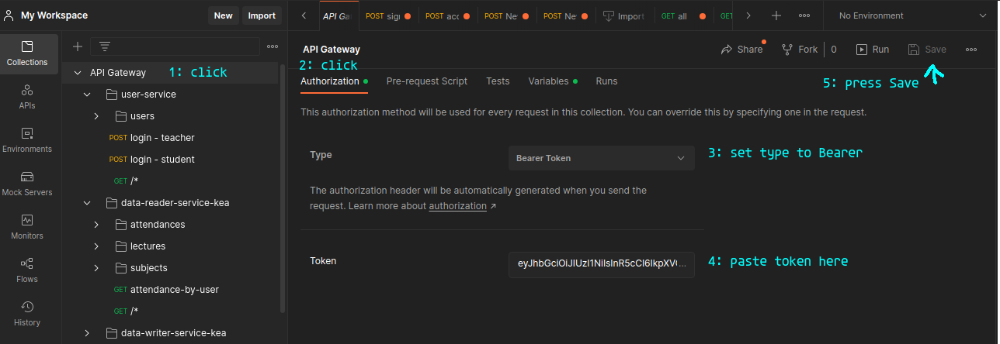
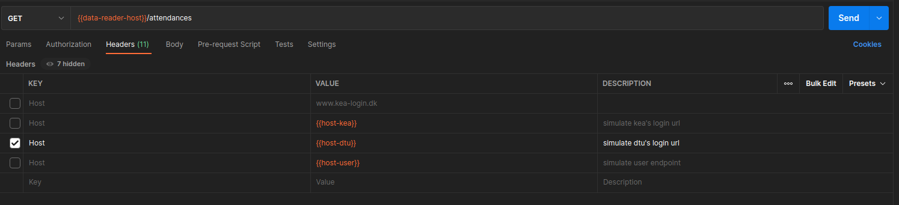
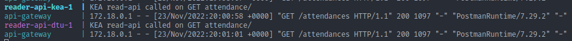
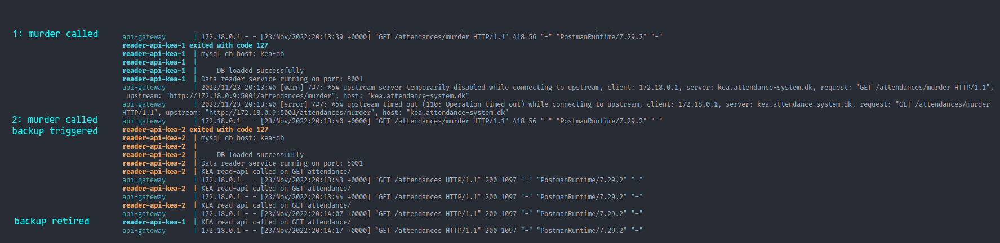

# API Gateway

### Table of Contents

 * [About](#about)
    * [Docker](#docker)
    * [Nginx](#nginx)
    * [Docker Compose](#docker-compose)
 * [How to](#how-to)
    * [Basic commands](#basic-commands)
    * [Instructions](#instructions)
        * [Setting up Postman](#setting-up-postman)
        * [Making calls as schools](#making-calls)

    
# About
This project was created to showcase how an nginx nginx reverse proxy acting as a load balancer.

To create it, a project was taken from the KEA class for Development of Large Systems. It was adapted to become stateless and be independently replicable. The original project was split into three core APIs. One API designed to read from the database, one API to write to the database, and a final api to handle user authentication.

The projects aim was to make a system where a teacher can mark students attendance without having to individually call out all the students individually. 

This system works by having the teacher user able to generate a code for their classroom, and then display this on their classroom's projector.

The students then can sign in on their student accounts and mark their own attendance by writing that code down on their own front end.

Once the project was adapted, it was decided that two schools would be simulated for this, KEA and DTU.

## Docker
The project was containerized and put into a single Docker Compose to make it easy to spin up.

As this project is only a demo, all required .env files are also included in the repository, and have been renamed so as to not be a problem once released into the wild.

## Nginx
Nginx works as the entry point into the system. It reroutes traffic based on the host url. This project is configured to listen for two different hosts, mimicking two different 'schools' that would utilize the system.

## <a name="docker-compose">Docker Compose
Docker compose will automatically load all needed .env files and boot up the following systems:

### User Service:
* **user-api-1**: This is the only user service and authorization service, works for both schools. 
* **user-api-2**: This is a replica of user-api-1 and works and is load-balanced in round robin fashion to avoid overloading.
* **user-db**: This is the database that stores all user data.

### KEA Services:
* **reader-api-kea-1**: This is the main instance of the KEA reader API.
* **reader-api-kea-2**: This is the backup instance of the KEA reader API.
* **writer-api-kea-1**: This is the main instance of the KEA writer API.
* **writer-api-kea-2**: This is the backup instance of the KEA writer API.
* **kea-db**: This is the database that all instances of KEA services connect to.

### DTU Services:
* **reader-api-dtu-1**: This is the main instance of the DTU reader API.
* **reader-api-dtu-2**: This is the backup instance of the DTU reader API.
* **writer-api-dtu-1**: This is the main instance of the DTU writer API.
* **writer-api-dtu-2**: This is the backup instance of the DTU writer API.
* **dtu-db**: This is the database that all instances of DTU services connect to. 

### Nginx
* **api-gateway**: This functions as the entrypoint to all the other services

Nginx is set up as follows:
Each school has two instances of their core API running at all times. If the main instance of either API is ever taken down, the backup will fire up to handle the traffic. Every 30 seconds Nginx will try to use the primary again, and if it has come back online, will redirect traffic back to the main instance, keeping the backup for future downtime.

The user service on the other hand, has both of it's instances running at all times, and all traffic is routed to one or the other to assure maximum throughput, as this service is contacted rather often by both schools.

# <a name="how-to">How to

## <a name="basic-commands">Basic commands

There are only two terminal comnands needed to get this project running:
* `docker-compose up`
* `docker-compose down`

To launch everything at once, from the root of the project run`docker-compose down`. This may take some minutes depending on internet speed and machine power.

To shutdown everything, press CTRL+C, this sends the shutdown signal to docker. 

If you do not have access to that terminal anymore, you can also shut it down by writing, from the root of the project: `docker-compose down`.

Run `docker-compose down` a second time to remove the containers as well.

## <a name="Instructions">Instructions

### <a name="postman-setup">Setting up Postman

Inside the docs folder i have included a [postman collection](./docs/API%20Gateway.postman_collection.json), I **strongly** advise using that as it is pre-configured for exactly this demo. 

This can be imported by going to your postman collections, and clicking the import button.

From there, select the file from the directory in `docs/API Gateway.postman_collection.json` and select the import button.

Once that is done, you will have a new collection named API Gateway.

This collection has most interactions ready to send with clear naming.

To begin, call the endpoint under user-service: `login - teacher` or `login - student`. For simplicity, there is only one login for both schools.

This will return a token. This is a JWT token that is valid for 1 hour. To use this token set it a workspace level so that you can try out various endpoints without having to paste the token multiple times.

To do this, click on the `API Gateway` workspace, then click on the `Authorization` tab, select the Type to be `Bearer Token` and paste the token you got from the previous request here, lastly, don't forget to save, as nothing will work until that is done.

Now you are ready to make some calls.

Teachers have more callable endpoints that students, so feel free to try endpoints to see what you can or can not access, however, this is not a project that had much focus on security, so in general, there is far more access that there should be. If access is denied, you will receive a 401 with a JSON message stating so.

### <a name="making-calls">Making calls as schools
To make this as easy as possible i have pre-configured the Headers of all requests with three presets: host-kea, host-dtu and host-user. For the purposes of this I will only be using the two school ones. 

For this demo I have signed in as a teacher.

Head into data-reader-service -> attendances -> all.

If you click the Headers tab, you should see the pre-made Host headers i just mentioned, selecting either will allow you to make a call as though you where doing it from one of those schools.

If you make two calls, one with each header set, you should see logs that look like this from the docker compose output:

These are the individual services' logs about communication. Notice also how its only ever number 1 that of each school service that responds.

### Triggering a failure and making the backup come online

In order to be able to use number 2 of these I have made a little endpoint that will trigger a shutdown on the service it is called on.
This endpoint is always labeled as 'MURDER' in the workspace.

Since all these images are local, they will restart very quickly, so in order for the murder endpoint to work, it will have to be called twice. The first one will kill the instance it is called on, the second, after 1 second of timeout, will force Nginx to redirect the request to the second instance, killing it too. But since Nginx now knows that image 1 is down, it will only attempt to re-contact it after 30 seconds, allowing the demo to work.

For the next 30 seconds, any calls to the service that was just murdered will send all requests to the 2nd instance. This continues until the main instance is registered as online, at which point all traffic will once again return to it.

Example:

